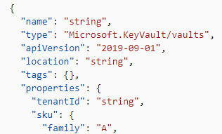

+++
author = "Thibault"
title = "Azure KeyVault Sku Family A wtf?"
date = "2021-03-08"
description = "Sample article showcasing basic Markdown syntax and formatting for HTML elements."
tags = [
    "markdown",
    "css",
    "html",
]
categories = [
    "KeyVault",
]
+++

# Mais pourquoi le Sku Family d'un KeyVault est 'A' ???
